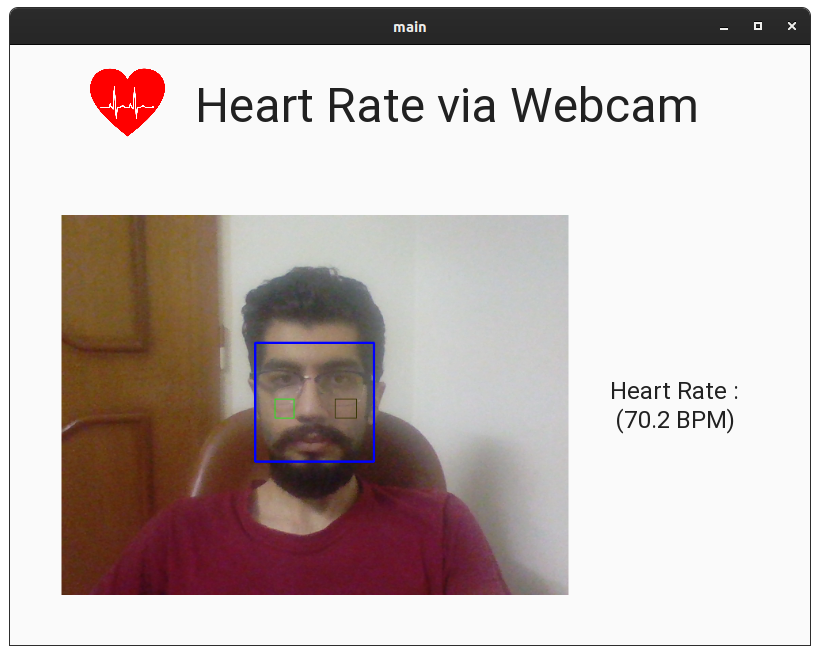
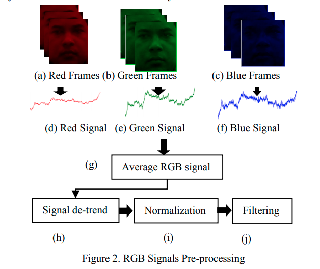
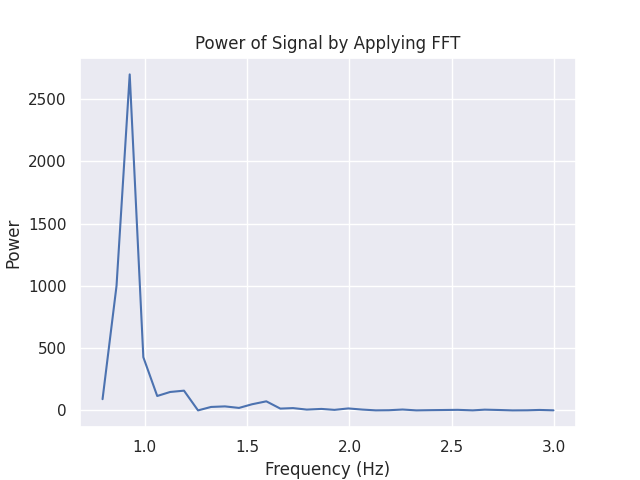

## Heart Rate Measurment From Video

to run interactive user interface first install requirements by   
`pip install -r requirements.txt`  
and the run GUI.py:   
`python GUI.py`

This repo provides implementation for two papers on measuring heart rate from video :

-   Real Time Heart Rate Monitoring From Facial RGB Color Video Using Webcam H. Rahman, M.U. Ahmed, S. Begum, P. Funk

-   Measuring Heart Rate from Video Isabel Bush

### Big picture
Heart rate can be detected without contact through changes in light, transmitted from human face; these changes are almost invisible to human eyes.
Verkruysse et al. found that this signal could be detected in multiple locations on the body, it was strongest on the face.

### How does it work ?

there four major steps:
1.   Video display and extract each image frame
2.   Face detection and facial image extraction
3.   RGB signal extraction and pre-processing
4.   Extraction of HR using ICA, PCA, FFT methods

preprocessing mentioned in step 2 is as follows (image from Ref 1)

